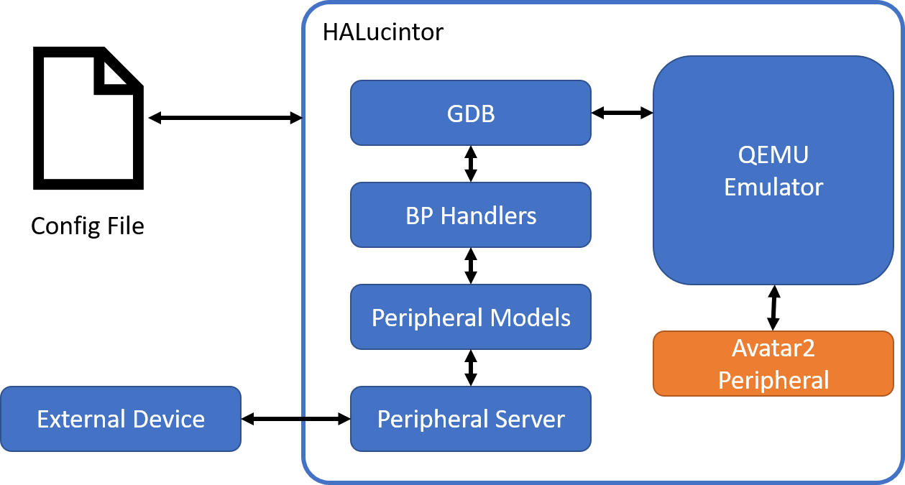

# Tutorial

This tutorial walks through how HALucinator works and how you can implement
your own components to enable re-hosting of firmware.  If you implement components
to support new abstraction layers, we'll happily take pull requests.

## Overview

HALucinator re-hosts firmware in an emulator to remove the need to have hardware
to perform testing of firmware.  It does this using an approach called
High Level Emulation (HLE). By using HLE instead of trying to make the emulator
perfectly match the hardware, we identify abstractions used within the firmware
and replace them with high level models that provide sufficient functionality.

As an example, consider a UART used for serial communication.  In the physical
system, the firmware will communicate with it by reading and writing a series of
memory mapped registers. Each register and bits within them have a specific
effect like setting clock sources, clock divisors, indicating data is available,
providing the data, writing data, etc.  If we want to emulate the UART we have
to understand what every bit of these registers does, implement it and the
state machine that connects them.  Considering the huge numbers of different
micro-controllers and that most have different implementations of their UARTs, 
emulating at scale becomes a daunting problem.  

This is a challenge for developers, as well, so manufactures provide, and/or developers
write Hardware Abstraction Libraries (HAL)'s to simplify the emulation process.
You can think of these HAL's as the driver functions for bare-metal systems.
HAL's provide functions like `HAL_UART_Transmit` which performs all interactions
needed with UART registers to send data.  Using HLE instead of implementing the
UART to transmit data, we simply intercept the execution of the `HAL_UART_Transmit`
function, read out the data and then return from the function without executing
it. We then manage and correct any state to make it appear the function executed
correctly (or incorrectly if that is what we want). We do the same thing for other
peripherals.  This is not only easier to do, but scales better as manufactures use
the same HAL's for entire families of devices. For example, STMicroelectronics
provides a HAL that covers all their ARM Cortex-M devices.  For more details on
the concepts of HALucinator please see our [USENIX Security 2020
paper](https://www.usenix.org/conference/usenixsecurity20/presentation/clements)

## HALucinator Internals

Given this overview of HLE, let's take a look at the internals of HALucinator.

HALucinator takes a configuration file that sets up the re-hosting of the firmware.
The configuration file specifies:

* The architecture the emulator should use (Currently only ARM Cortex-m0/m3 and ARMv5)
* The entry point to start executing
* The firmware and where it should be located in the emulator
* The memory layout to be used by the emulator
* The functions to intercept and how to handle them

Using this configuration file, HALucinator starts the emulator (QEMU) and connects
GDB to it.  It then uses GDB to set breakpoints (BPs) at the location of all functions
to intercept, and registers a BP Handler to be executed when the breakpoint is hit.
The BP Handler reads/writes data from the emulator and manages the state to
make it appear the function executed as we desired.  It then returns and execution
of the emulated firmware continues as if the function executed.  The BP Handler
leverages a peripheral model that implements generic behaviors for peripherals
(e.g., Send ethernet frames, read/write serial data, etc). Going back to the UART
example, all UARTs send/receive data, but the HAL functions for various UARTs are
different.  We implement sending and receiving data for a UART once in the peripheral
model. The BP Handlers handle the differences in the HAL functions and are responsible
for extracting the data from the emulator and passing it to the peripheral model.
The Peripheral Models then communicate with the Peripheral Server which sends and
receives data from external devices.  This enables controlling all the IO from a
single point and doing so in flexible way.

Note: The Peripheral Server is called the IO Server in the USENIX Security 2020
paper. In the code, Peripheral Server is most commonly used so that is the name
used in this tutorial.

Throughout, HALucinator uses [Avatar2](https://github.com/avatartwo/avatar2)
to control the execution of the many different components. HALucinator can
also use Avatar2's Peripherals which provide a way to implement a peripheral at
the MMIO register level.  However, we try not to do this as generally HLE is
easier and more scalable.

Now let's run an example: [2_run_uart_example.md](2_run_uart_example.md)
