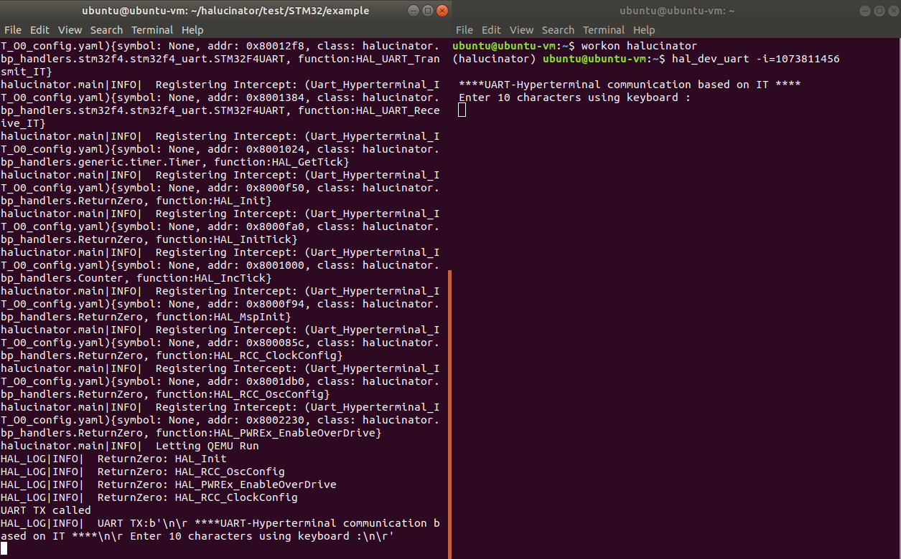
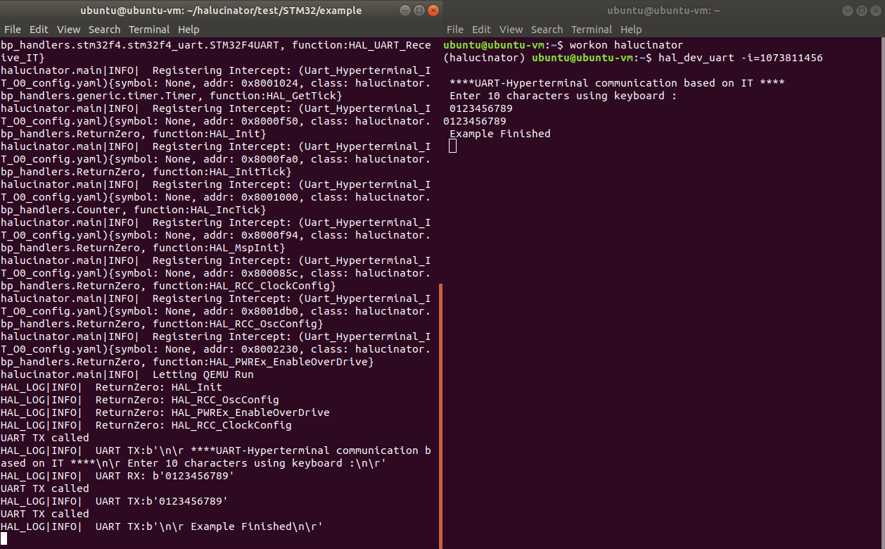

# Run HALucinator on UART Example

Now lets run HALucinator

For the first example, we are going to run a simple binary that sends a couple
messages over a UART and then waits for 10 characters to be sent back over the
UART.  The binary then echos those characters back, prints another message, and
enters an infinite loop.  This is the same example as in HALucinator's README and
is located in `~/halucinator/test/STM32/example`. All commands should be run from
there unless otherwise specified.  We will use this example firmware throughout 
this tutorial.


```c++
/* Buffer used for transmission */
uint8_t aTxStartMessage[] = "\n\r ****UART-Hyperterminal communication based on IT ****\n\r Enter 10 characters using keyboard :\n\r";
uint8_t aTxEndMessage[] = "\n\r Example Finished\n\r";
/* Buffer used for reception */
uint8_t aRxBuffer[RXBUFFERSIZE];

int main(void)
{
  HAL_Init();

  SystemClock_Config();

  /* Configure leds */
  BSP_LED_Init(LED1);
  BSP_LED_Init(LED2);
  BSP_LED_Init(LED3);

  /* ##-1- Configure the UART peripheral ###################################### */
  UartHandle.Instance        = USARTx;

  UartHandle.Init.BaudRate   = 9600;
  UartHandle.Init.WordLength = UART_WORDLENGTH_8B;
  UartHandle.Init.StopBits   = UART_STOPBITS_1;
  UartHandle.Init.Parity     = UART_PARITY_ODD;
  UartHandle.Init.HwFlowCtl  = UART_HWCONTROL_NONE;
  UartHandle.Init.Mode       = UART_MODE_TX_RX;
  UartHandle.Init.OverSampling = UART_OVERSAMPLING_16;

  if(HAL_UART_Init(&UartHandle) != HAL_OK)
  {
    /* Initialization Error */
    Error_Handler();
  }

  /*##-2- Start the transmission process #####################################*/  
  if(HAL_UART_Transmit_IT(&UartHandle, (uint8_t*)aTxStartMessage, TXSTARTMESSAGESIZE)!= HAL_OK)
  {
    /* Transfer error in transmission process */
    Error_Handler();
  }

  /*##-3- Put UART peripheral in reception process ###########################*/  
  if(HAL_UART_Receive_IT(&UartHandle, (uint8_t *)aRxBuffer, RXBUFFERSIZE) != HAL_OK)
  {
    /* Transfer error in reception process */
    Error_Handler();
  }

  /*##-4- Wait for the end of the transfer ###################################*/
  while (HAL_UART_GetState(&UartHandle) != HAL_UART_STATE_READY)
  {
  }

  /*##-5- Send the received Buffer ###########################################*/  
  if(HAL_UART_Transmit_IT(&UartHandle, (uint8_t*)aRxBuffer, RXBUFFERSIZE)!= HAL_OK)
  {
    /* Transfer error in transmission process */
    Error_Handler();
  }

  /*##-6- Wait for the end of the transfer ###################################*/  
  while (HAL_UART_GetState(&UartHandle) != HAL_UART_STATE_READY)
  {
  }

  /*##-7- Send the End Message ###############################################*/  
  if(HAL_UART_Transmit_IT(&UartHandle, (uint8_t*)aTxEndMessage, TXENDMESSAGESIZE)!= HAL_OK)
  {
    /* Turn LED3 on: Transfer error in transmission process */
    BSP_LED_On(LED3);
    while(1)
    {
    }
  }

  /*##-8- Wait for the end of the transfer ###################################*/  
  while (HAL_UART_GetState(&UartHandle) != HAL_UART_STATE_READY)
  {
  }

  /* Infinite loop */  
  while (1)
  {
  }
}

static void Error_Handler(void)
{
  /* Turn LED3 on */
  BSP_LED_On(LED3);
  while(1)
  {
  }
}

```

The most relevant portions of the code to understand `main` are above. You
will notice is sends `aTxStartMessage`, then reads `RXBUFFERSIZE` characters
into aRxBuffer, writes it back out the UART, and then writes `aTxEndMessage`. If
at any point there is an error, it calls `Error_Handler` and turns on `LED3`.

## Start UART application
To run the example we need two terminals, one to run the UART external devices that
receives and sends characters from/to HALucinator, and another to execute the
firmware in HALucinator.

Open a terminal and start the UART external device.  This application subscribes
to the peripheral server for UART messages with the id provided by `-i` option.

```bash
workon halucinator           # Activates the virtual environment
cd ~/halucinator/test/STM32/example
hal_dev_uart -i=1073811456   # Start the uart dev for UART data with id -i
```

## Run firmware in HALucinator

Next we will start up HALucinator.  For it to run, it needs to know the memory layout
the firmware expects and the firmware itself.  In addition, we want to specify
functions to intercept HAL functions and handlers for each.  These are all
specified in a config file.
For portability, these are usually spread out across multiple files and we'll go
through the contents later. These are provided to HALucinator which then
concatenates them into a single configuration internally. For this example, the
configuration is split across three files.  `Uart_Hyperterminal_IT_O0_memory.yaml`
describes the memory layout and where to put the firmware. The name of the functions
to intercept and the handler for each are specified in
`Uart_Hyperterminal_IT_O0_config.yaml`, and the mapping of function names to addresses
in the firmware is provide by `Uart_Hyperterminal_IT_O0_addrs.yaml`.  Separating
the addresses enables the same config to be used for multiple firmware, by
providing a different address file.

We are also going to specify another option to save a trace of the execution by
using `--log_blocks=trace-nochain`.  This will capture every instruction QEMU executes,
and disable caching of blocks inside QEMU. It's not needed but provides high visibility
into what is happening.  However, it can cause significant slow down in the emulator,
and create very large log files.  For long running, examples leave off the `--log_blocks`
option.

Putting it all together. Open another terminal and execute below.

```bash
workon halucinator
cd ~/halucinator/test/STM32/example
halucinator -c Uart_Hyperterminal_IT_O0_memory.yaml -c Uart_Hyperterminal_IT_O0_config.yaml -c Uart_Hyperterminal_IT_O0_addrs.yaml --log_blocks=trace-nochain
```



You should now see in your two terminals the image above, with HALucinator on the
left and the external device on the right.  You will notice HALucinator printing
out messages during its initialization, and then `Letting QEMU Run` after that
point denotes the firmware is executing. You'll notice several HAL functions being
intercepted by the `ReturnZero` handler and then the UART TX handler runs and
sends a long string.  This same string shows up in the UART external device on the right.

Now enter 10 characters (e.g., `0123456789`) in your `hal_dev_uart` terminal and press enter
You should now see something like below.


When you entered the 10 characters and pressed enter, the UART external devices
sent them to the HALucinator.  When the HAL RX function was called, it entered
a BP Handler that received these bytes and copied them into the firmware's receive
buffer and then returned.  The firmware then echoes the characters back, again
triggering the UART TX handler.  The firmware then sends the message `Example Finished`
over the UART which we see in the UART External device.

Press `ctrl-c` in both terminals to exit
```
ctrl-c
```

## Examine Outputs

Now lets examine some of the outputs created by running HALucinator. HALucinator saves
a bunch of information in `tmp/HALucinator` that can be examined after execution.
(Note: the `-n <RUN_NAME>` option to halucinator changes where these files are saved.)

These files are:

* HALucinator_conf.json  -- Configuration file given to QEMU to build machine for emulation
* HALucinator_err.txt    -- Stderr for QEMU
* HALucinator.log        -- Log details for Avatar
* HALucinator_out.txt    -- Stdout for QEMU
* qemu_asm.log           -- Trace information output by QEMU from the --log_blocks option
* stats.yaml             -- Statistic information from halucinator, about what intercepts were used how often, when, etc.

If HALucinator fails to run, then examining the `_err.txt` and `_out.tx` can often
be helpful.  However, of most interest is usually the `qemu_asm.log`. This is a
text file listing the disassembly of the basic blocks as they executed.  
It can be opened in a text editor, but is often very large. To see the last 100
lines of the execution trace use tail.

```bash
tail -n 100 tmp/HALucinator/qemu_asm.log
```

## Config files

Now lets examine the config files to see what we told HALucinator to do.
We will use Visual Studio code for this.

Run
```
code ~/halucinator/test/STM32/example
```

### Memory configuration

First open up `Uart_Hyperterminal_IT_O0_memory.yaml`.  This specifies the
memories used in the emulator.  


```yaml
memories:
  alias: {base_addr: 0x0, file: Uart_Hyperterminal_IT_O0.elf.bin,
    permissions: r-x, size: 0x800000}
  flash: {base_addr: 0x8000000, file: Uart_Hyperterminal_IT_O0.elf.bin,
    permissions: r-x, size: 0x200000}
  ram: {base_addr: 0x20000000, size: 0x51000}
peripherals:
  logger: {base_addr: 0x40000000, emulate: GenericPeripheral, permissions: rw-, size: 0x20000000}
```

We have `alias`, `flash`, and `ram` memory areas and a peripheral called `logger`.
Each specifies a base address, size, and permissions. The `alias`, and `flash`
memories specify a file that contains the firmware.  The contents of the file are
copied into the memory before execution begins. The file's path is
relative to the path of config file (i.e., `Uart_Hyperterminal_IT_O0_memory.yaml`).
In this case, the file is specified twice because the real hardware aliases the
memory at 0x800000 to address 0. Since the memories are not written to by the
firmware we can mimic this by putting the firmware in both places.

You will also note that under peripherals is a `logger`.  It used Avatar2's peripheral
class to implement a peripheral that handles memory accesses in the range starting
at `0x40000000`.  The emulate parameter specifies the class that handles this range
and is located in `~/halucinator/src/halucinator/peripheral_models/generic`.
The `GenericPeripheral` just returns zero for all reads, and ignores all writes.
This prevents the emulator from crashing if something does try to access a
peripheral and enables recording unhandled accesses to MMIO.

### Address file

Next, open up the address file `Uart_Hyperterminal_IT_O0_addrs.yaml`.  A
sample of this file is shown below.

```yaml
architecture: ARMEL  # Ignored
base_address: 0      # Ignored on cortex-m
entry_point: 0       # Ignored on cortex-m
symbols:
  134218164: deregister_tm_clones
  134218196: register_tm_clones
  134218232: __do_global_dtors_aux
  134218272: frame_dummy
```

The first three options are ignored on the cortex-m3 in HALucinator, are
derived from the firmware, and are present for historical reasons. The `symbols`
entry contains a dictionary mapping addresses to function names. They are used
to resolve the address at which breakpoints are placed.  This file can be obtained
from an elf file using the HALucinator tool `hal_make_addr`.  This was used to
create this file for this example by running.

```bash
hal_make_addr -b Uart_Hyperterminal_IT_O0.elf -o addrs.yaml
```

The symbols can also be provided by passing in a csv file and passed
to HALucinator using the `-s` option.  The format is shown below.

```csv
symbol, start_addr, stop_addr
```

### Intercept config

Now open up the intercept config file `Uart_Hyperterminal_IT_O0_config.yaml`.
It contains a list of intercepts that are placed in the firmware during execution
and defines the handler for each intercept.  Samples are shown below.


```yaml
intercepts:
- class: halucinator.bp_handlers.stm32f4.stm32f4_uart.STM32F4UART
  function: HAL_UART_Init
  symbol: HAL_UART_Init
- class: halucinator.bp_handlers.stm32f4.stm32f4_uart.STM32F4UART
  function: HAL_UART_Transmit_IT
  symbol: HAL_UART_Transmit_IT
- class: halucinator.bp_handlers.SkipFunc
  function: HAL_Delay
  symbol: HAL_Delay
- class: halucinator.bp_handlers.ReturnZero
  function: HAL_Init
  symbol: HAL_Init
- class: halucinator.bp_handlers.Counter
  function: HAL_IncTick
  symbol: HAL_IncTick
- class: halucinator.bp_handlers.IPythonShell
  function: HardFault_Handler
  symbol: HardFault_Handler
```

Each handler specifies:

* `class`: The import path to a python class that subclasses `halucinator.bp_handlers.BPHandler`
* `function`: Identifies the method within the python class used for this intercept
* `symbol`: The name of the function in the firmware this intercept is for. It
            is used to lookup the address where the breakpoint should be set in
            the symbols provided by the address config file.

HALucinator only instantiates each call once, even if multiple intercepts
specify the same class.  There are also a number of optional fields that can be
specified on each intercept described in the main HALucinator README.

HALucinator provides a number of generic handlers for commonly used operations
including:

* `halucinator.bp_handlers.SkipFunc`  Just returns from the function without executing it and without a return value.  Useful if you just want to skip a function that returns `void`
* `halucinator.bp_handlers.ReturnZero` Returns zero from the function without executing it
* `halucinator.bp_handlers.Counter`  Returns an increasing value for each call. Does not execute the function.
* `halucinator.bp_handlers.IPythonShell` Drops into an IPython shell enabling interactive control at that point. Frequently used for debugging.

There are many more that can be found in `src/halucinator/bp_handler` of the
HALucinator repo.  We will cover the UART handlers in detail in the next tutorial.
[3_uart_deep_dive.md](3_uart_deep_dive.md)
