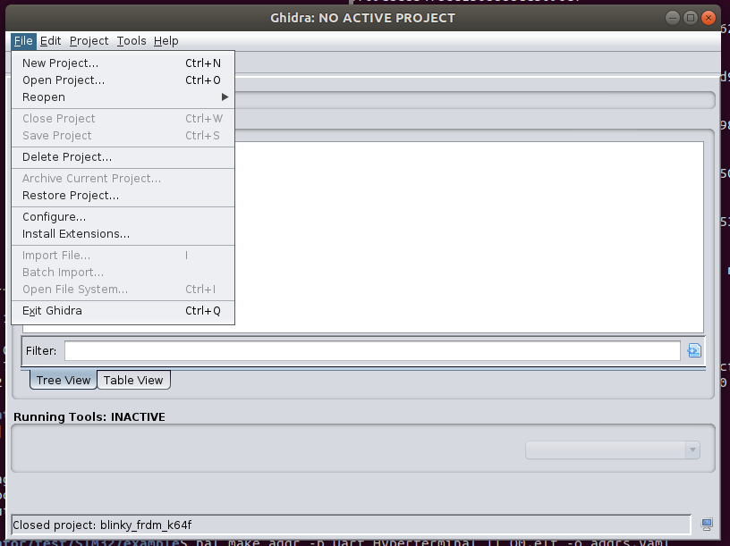
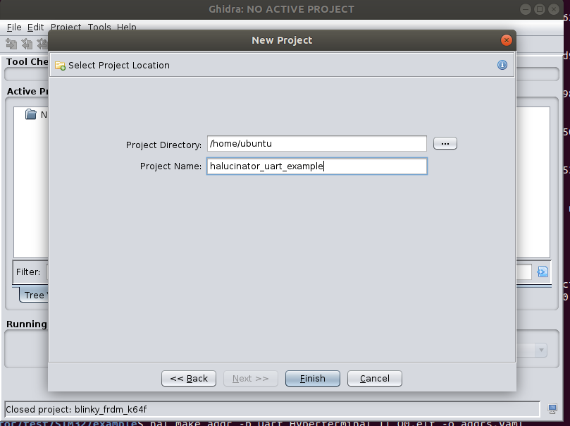
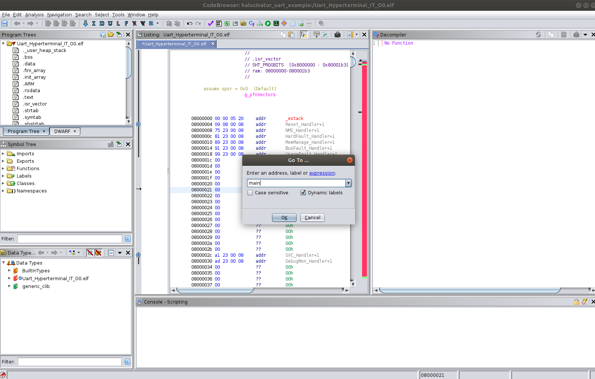
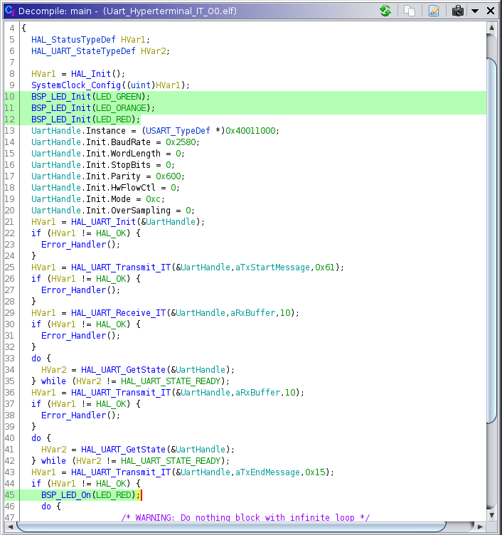
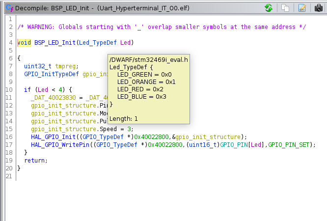

# Extending Halucinator

The example firmware in addition to printing messages on the UART also turns on
an LED to indicate a failure.  Handlers for the LED's have not been
implemented.  In this tutorial we are going to implement them, and replace an
existing `HAL_UART_Receive_IT` handler with a different handler to indicate it
failed. The first step will be to
identify the function calls and their parameters needed to capture the LED state.

To do this we are going to use Ghidra to look at the binary of the firmware.  
Then we will implement breakpoint handlers to capture writing to the LED's. After
testing those, we will add a peripheral model and external device to enable sending
and receiving the LED status and UART data on the Peripheral Server.

## Find the Functions To Intercept

The first thing we need to do is identify the function's to intercept and
their parameter values. We could use the source for this, but for the moment
we are going to pretend it is unavailable and use Ghidra to find this information.
Ghidra is a Software Reverse Engineering tool create
by the NSA and released as open source software. We will walk through some of its
use in this tutorial, but barely scrape the surface of its capabilities.

Note:  Even though we are using the binary instead of source we are still cheating,
likely a lot, because we have symbols and data types in the firmware.  If we
were analyzing another firmware we probably would not have this
information and LibMatch and/or intensive RE would be needed. However, even in cases
when I have source, I often use Ghidra to look at the firmware when implementing
things in HALucinator.  Build systems and compilers can do some 'magical'
transformations to source code making it hard to understand what actually ends
up in the firmware.  As halucinator runs the firmware it is what's in it that matters.
So gaining some degree of comfort looking at binaries/firmware in Ghidra will be
worth your time.

Now lets start Ghidra in a new terminal.

```
~/ghidra_9.1.2/ghidraRun
```

Create a new project

```txt
File -> New Project
```



```txt
Select Non-Shared Project
click Next
```

Set Project Directory and Name to halucinator_uart_example



```
click Finish
```

Now import the elf file with the firmware.

```
File->Import File
Browse to /home/ubuntu/halucinator/test/STM32/example and select Uart_Hyperterminal_IT_00.elf
Click Select file to import
```


It will detect the Format, Language and other settings from metadata in the ELF.

```
Click OK
and
Click OK again
```

Now open the imported file in the CodeBrowser by double clicking on it.

```
Click yes to the Analyze prompt
Leave the defaults checked and click Analyze
```

Ghidra will now use information from the metadata in the ELF file and its own 
analyses to help you understand the binary. When it completes click on the 
disassembly (middle window) and press `G` (for goto), and type `main` then enter.



Looking at the decompiler this should look pretty much like the C code.



In it you will notice four function calls of interest. Three to `BSP_LED_Init` and
one to `BSP_LED_On`. We will be implementing handlers for the `BSP_LED_Init`, and `BSP_LED_On`
functions, in a production firmware this layer would likely be inlined by the compiler
and we would have to go lower to the `HAL_GPIO_Init`, and `HAL_GPIO_WritePin` functions.
Double click on the `BSP_LED_Init` function to go to its code.

To intercept `BSP_LED_Init` we are going use halucinator to intercept on the
first instruction of `BSP_LED_Init` (0x080022cc).  We then will need to know
what values map to which LED.  Fortunately the symbols in the file make this
easy.  Hover over the `Led_TypeDef` in the `BSP_LED_Init` function signature
and tool tip will pop up with more info.



This tells us how to map a numeric value to the correct LED on the board.

You can click the back arrow (upper left) to go back to main and then double
click on the call to `BSP_LED_On` and verify it takes a single parameter of
type `Led_TypeDef`.  Also look at `Error_Handler()` notice it turns on the RED_LED
and enters an infinite loop.

Great now we know the functions we need to intercept and the values
they will receive for each LED.  Let's proceed to implementing
the `BPHandler` we will use to intercept these functions.

## Extending HALucinator

We are going to implement handlers for the functions:

* BSP_LED_Init
* BSP_LED_On
* BSP_LED_Off  -- Not present in this binary but lets do it for good measure

They all take a type `Led_TypeDef` which has the following mapping.

* LED_GREEN 0x0
* LED_ORANGE 0x1
* LED_RED 0x02
* LED_BLUE 0x03

### Setup

Copy the tutorial folder in the halucinator repo into a new directory 
`halucinator_tutorial` in your home directory.  This keeps the halucinator
repo's tutorial in a clean state.

RUN
```bash
cp -r ~/halucinator/tutorial ~/halucinator_tutorial
cd ~/halucinator_tutorial

```
  
We are going to build our extensions as their own python module. The required 
`setup.py` has been created for you. You just need to install this it using the 
below commands.

```bash
workon halucinator  # If you virtual environment isn't already active
pip install -e .
```

Notes:

* The `-e` option tells pip to leave the module package here and any change you 
make to the python code will be reflected in your execution without reinstalling
the package.
* However, if you add a new entry point in `setup.py` you will have to re-run `pip install`
* You don't have to create your own module, but can develop directly in the 
halucinator repo under the appropriate src/halucinator/(bp_handlers, 
external_devices, and peripheral_modules directory).  If you develop components
that would be of use to the wider community pull requests are welcome, and 
building them inside the halucinator directories is preferred.

Now we are ready to start implementing. Open up your favorite editor

RUN
```
code ~/halucinator_tutorial
```

If you look in the folder we are going to implement/modify five files in this order:

* `hal_tutorial/bp_handlers/led_bp_handlers.py`  LED break point handlers
* `my_config.yaml`   The configuration file to add the new intercepts
* `hal_tutorial/peripheral_models/led_peripheral.py`  Our new LED peripheral model
* `hal_tutorial/external_devices/led_external_devices.py`  The new external device
* `logging.cfg`     The file halucinator uses to control its logging

Each of these files has steps that need completed that can be found by searching
for STEP in the file.

### Setup Config File and Run
    
Everything you need to run the tutorial has been stubbed out for you.
Let's start by completing the intercept description
so we can run the example using the stubs.

Open `my_config.yaml` and complete the Steps. 
This has two steps:
1. Adding a map to the LEDHandler constructor so we get nice
names for our LED's instead of numbers. Note: the `class_args` value enables us
pass parameters to the class constructor.  However, to ensure it gets processed
it needs to be used on every intercept.
2. Adding the intercept for the BSP_LED_On function

Now lets run with our new config, we are going to use the same config files as 
last time, and just add our new config file to the end.  This makes it take
precedence over any prior described intercepts.

RUN
```bash
workon halucinator
cd ~/halucinator_tutorial
halucinator -c ~/halucinator/test/STM32/example/Uart_Hyperterminal_IT_O0_memory.yaml \
-c ~/halucinator/test/STM32/example/Uart_Hyperterminal_IT_O0_config.yaml  \
-c ~/halucinator/test/STM32/example/Uart_Hyperterminal_IT_O0_addrs.yaml \
-c my_config.yaml
```

OUTPUT
```
```bash
halucinator.main|INFO|  Letting QEMU Run
HAL_LOG|INFO|  ReturnZero: HAL_Init 
HAL_LOG|INFO|  ReturnZero: HAL_RCC_OscConfig 
HAL_LOG|INFO|  ReturnZero: HAL_PWREx_EnableOverDrive 
HAL_LOG|INFO|  ReturnZero: HAL_RCC_ClockConfig 
hal_tutorial.bp_handlers.led_bp_handler|INFO|  Init Called
hal_tutorial.bp_handlers.led_bp_handler|INFO|  Init Called
hal_tutorial.bp_handlers.led_bp_handler|INFO|  Init Called
HAL_LOG|INFO|  UART 1073811456 TX:b'\n\r ****UART-Hyperterminal communication based on IT ****\n\r Enter 10 characters using keyboard :\n\r'
hal_tutorial.bp_handlers.led_bp_handler|INFO|  LED On Called
```

RUN
```bash
ctrl-c  # To stop halucinator
```

You should get something like the above notice the three calls to 
`hal_tutorial.bp_handlers.led_bp_handler|INFO|  Init Called` and the one to
`hal_tutorial.bp_handlers.led_bp_handler|INFO|  LED On Called` this means
our new break point handlers are getting executed.  Let's extend them to 
make them useful.

### LED BP Handler Class

The BP handler has been stubbed out for you in `hal_tutorial/bp_handlers/led_bp_handlers.py`.  
Complete the steps to extract LED Id and pass it to the model. Then run it
again.

RUN
```
halucinator -c ~/halucinator/test/STM32/example/Uart_Hyperterminal_IT_O0_memory.yaml \
-c ~/halucinator/test/STM32/example/Uart_Hyperterminal_IT_O0_config.yaml  \
-c ~/halucinator/test/STM32/example/Uart_Hyperterminal_IT_O0_addrs.yaml \
-c my_config.yaml
```

OUTPUT
```bash
halucinator.main|INFO|  Letting QEMU Run
HAL_LOG|INFO|  ReturnZero: HAL_Init 
HAL_LOG|INFO|  ReturnZero: HAL_RCC_OscConfig 
HAL_LOG|INFO|  ReturnZero: HAL_PWREx_EnableOverDrive 
HAL_LOG|INFO|  ReturnZero: HAL_RCC_ClockConfig 
hal_tutorial.bp_handlers.led_bp_handler|INFO|  Init Called
hal_tutorial.peripheral_models.led_peripheral|DEBUG|  LED Off GREEN
hal_tutorial.bp_handlers.led_bp_handler|INFO|  Init Called
hal_tutorial.peripheral_models.led_peripheral|DEBUG|  LED Off ORANGE
hal_tutorial.bp_handlers.led_bp_handler|INFO|  Init Called
hal_tutorial.peripheral_models.led_peripheral|DEBUG|  LED Off RED
HAL_LOG|INFO|  UART 1073811456 TX:b'\n\r ****UART-Hyperterminal communication based on IT ****\n\r Enter 10 characters using keyboard :\n\r'
hal_tutorial.bp_handlers.led_bp_handler|INFO|  LED On Called
hal_tutorial.peripheral_models.led_peripheral|DEBUG|  LED On RED
```

RUN
```bash
ctrl-c # To stop halucinator
```

Notice the new calls to `hal_tutorial.peripheral_models.led_peripheral|DEBUG|`
showing what LED's got turned off and on. Let now extend the peripheral model 
and external device to sent this info outside halucinator.

### Peripheral Model

Before implementing the model let's think about the model for an LED.  
It is an output only device, which means halucinator will only publish messages
about its status.  It has two values `on` and `off`.

A template for the peripheral model is provided in 
`hal_tutorial/peripheral_models/led_peripheral.py` open it up and there 
are 5 tasks the need completed.  Complete them all and then proceed.

### External Device

You now need to setup our external device to receive both the UART messages and
the LED status messages.  To do this we will create a new external device
based off the UART.  A template for it is in `hal_tutorial/external_devices/led_external_devices.py`
Complete the STEPS in it and then open a new terminal.  When pip installed
this package the `setup.py` added an entry point to `'led_external_devices.py`'s main
function called `my_led_device` to the path.  Open a new terminal and run it.

RUN in NEW Terminal
```
workon halucinator
my_led_device -i=1073811456
```

Note: it you didn't have an entry point you would have to run this using

```bash
python -m hal_tutorial.external_devices.led_external_devices
```

RUN in original terminal
```bash
halucinator -c ~/halucinator/test/STM32/example/Uart_Hyperterminal_IT_O0_memory.yaml \
-c ~/halucinator/test/STM32/example/Uart_Hyperterminal_IT_O0_config.yaml  \
-c ~/halucinator/test/STM32/example/Uart_Hyperterminal_IT_O0_addrs.yaml \
-c my_config.yaml
```

OUTPUT from terminal running halucinator

```bash
halucinator.main|INFO|  Letting QEMU Run
HAL_LOG|INFO|  ReturnZero: HAL_Init 
HAL_LOG|INFO|  ReturnZero: HAL_RCC_OscConfig 
HAL_LOG|INFO|  ReturnZero: HAL_PWREx_EnableOverDrive 
HAL_LOG|INFO|  ReturnZero: HAL_RCC_ClockConfig 
hal_tutorial.bp_handlers.led_bp_handler|INFO|  Init Called
hal_tutorial.peripheral_models.led_peripheral|DEBUG|  LED Off GREEN
hal_tutorial.peripheral_models.led_peripheral|DEBUG|  LED Status GREEN: False
hal_tutorial.bp_handlers.led_bp_handler|INFO|  Init Called
hal_tutorial.peripheral_models.led_peripheral|DEBUG|  LED Off ORANGE
hal_tutorial.peripheral_models.led_peripheral|DEBUG|  LED Status ORANGE: False
hal_tutorial.bp_handlers.led_bp_handler|INFO|  Init Called
hal_tutorial.peripheral_models.led_peripheral|DEBUG|  LED Off RED
hal_tutorial.peripheral_models.led_peripheral|DEBUG|  LED Status RED: False
HAL_LOG|INFO|  UART 1073811456 TX:b'\n\r ****UART-Hyperterminal communication based on IT ****\n\r Enter 10 characters using keyboard :\n\r'
hal_tutorial.bp_handlers.led_bp_handler|INFO|  LED On Called
hal_tutorial.peripheral_models.led_peripheral|DEBUG|  LED On RED
hal_tutorial.peripheral_models.led_peripheral|DEBUG|  LED Status RED: True
```

RUN
```bash
ctrl-c # To stop halucinator, leave external device running
```


Notice the new messages like 
`hal_tutorial.peripheral_models.led_peripheral|DEBUG|  LED Status RED: True`.

Now look at the led external device terminal and you should see something like

OUTPUT

```bash
LED: GREEN is Off
LED: ORANGE is Off
LED: RED is Off

 ****UART-Hyperterminal communication based on IT ****
 Enter 10 characters using keyboard :
 LED: RED is On
```

### Adjust the logging output

With everything working on for the LED's we no longer need to see the debug 
messages.  Halucinator automatically looks for a file called `logging.cfg` in 
the directory it is run from.  This file has been create for you.  Open this up 
and adjust the hal_tutorial logger to level INFO.

Then re-run halucinator

RUN in original terminal
```bash
halucinator -c ~/halucinator/test/STM32/example/Uart_Hyperterminal_IT_O0_memory.yaml \
-c ~/halucinator/test/STM32/example/Uart_Hyperterminal_IT_O0_config.yaml  \
-c ~/halucinator/test/STM32/example/Uart_Hyperterminal_IT_O0_addrs.yaml \
-c my_config.yaml
```

All of the log messages for `hal_tutorial` should no longer be displayed.
The logging file can be really useful for debugging and getting familiar with
it will help in implementing things in halucinator.  See (https://docs.python.org/3/library/logging.config.html#logging-config-fileformat)[https://docs.python.org/3/library/logging.config.html#logging-config-fileformat]
for details about how it works.  The `qualname` of each file will be its module name.

## Conclusion

This completes the tutorial.  You should now have an understanding of how
halucinator works and how to implement its major components, BPHandlers, 
Peripheral Handlers, and External Devices.  We also demoed how to adjust what 
is displayed using the logging.cfg file.
